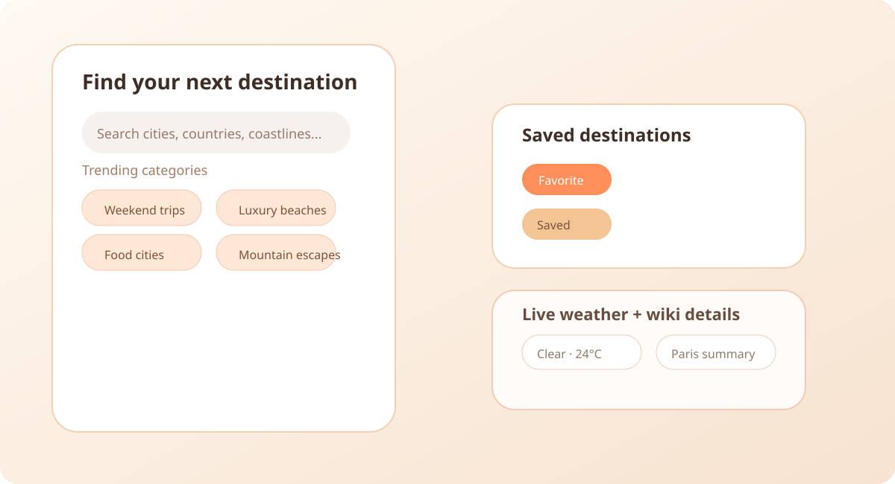
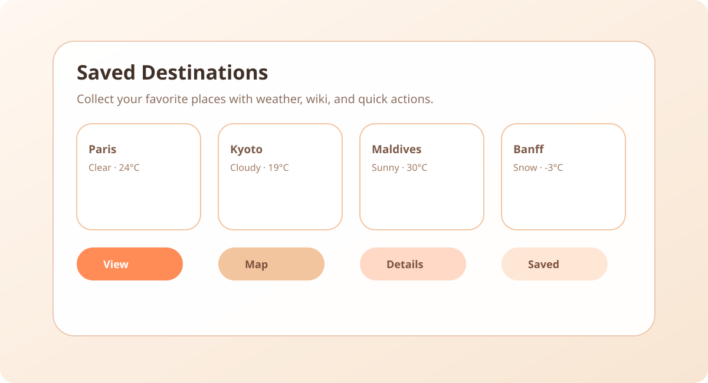
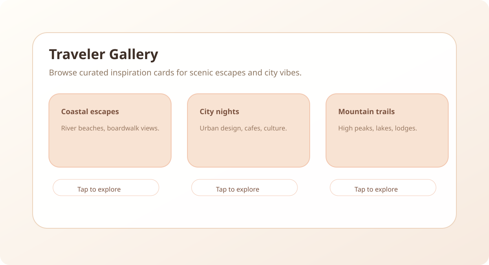

# Fly High


Fly High is a modern, responsive travel discovery web application built for explorers, planners, and weekend escape seekers. It lets travelers search places by city, country, or mood, view live weather, and save favorite destinations in a polished interface.

## 🌟 Features

- **Live destination lookup** using the Wikipedia API
- **Current weather details** via OpenWeatherMap
- **Personal favorites list** stored in `localStorage`
- **Dark / light mode** with memory between sessions
- **Trending travel prompts** and mood-driven search tags
- **Responsive glassmorphism design** with animated hero interactions

## 🛠️ Built With

- HTML5 & CSS3
- JavaScript (ES6)
- Bootstrap 4.6
- Particles.js
- Wikipedia API
- OpenWeatherMap API

## 📷 Visual Preview

### App hero preview


A welcoming home section with hero messaging, navigation, and quick travel prompts.

### Explore & Search



Search destinations, explore mood-based tags, and discover live travel ideas.

### Saved Destinations



Keep favorite places saved with weather details and easy access.

### Traveler Gallery



Browse curated gallery cards to build travel inspiration and moodboards.

## 🚀 Getting Started

1. Clone or download this repository.
2. Open `index.html` in your browser.
3. Add your OpenWeatherMap API key in `js/main.js`:

```js
const OPENWEATHER_API_KEY = "";
```

4. Save the file and refresh the page.
5. Search a destination and save favorites.

## 🔧 Weather API Setup

- Create an account at https://openweathermap.org/
- Generate an API key
- Paste it into `js/main.js` on the `OPENWEATHER_API_KEY` line
- The app will show live weather results while searching

## 📁 Project Structure

- `index.html` — main page layout
- `css/` — styling and animation files
- `js/` — application logic, API calls, and UI behavior
- `screenshots/` — preview image assets for the README

## 💡 Notes

- Wikipedia search works without an API key
- Favorites and theme choice persist in the browser
- Weather and search results require an internet connection

## 📝 License

Add a license file if you plan to publish this repository publicly.
